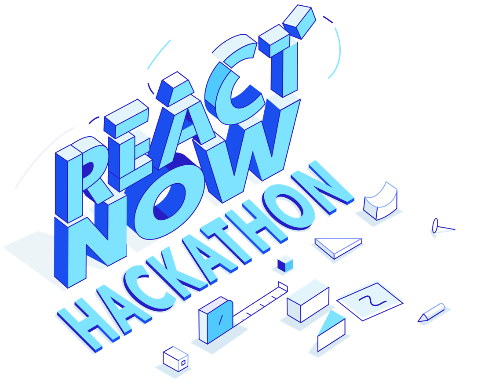

# Starts on 21st February, 2022

Low-code needs no introduction anymore, it’s out there, helping small, midsize, and large businesses turn their ideas into digital products with speed and scale. The next round of success belongs to the low-code play that allows developers to leverage composability and the ability to ship out products that can compete in the game of brilliant user experiences; accessible from anywhere. 
We think WaveMaker has a great footing, and with ReactNative upgrade, we are now positioned to offer developers the fair chance to make enterprise-grade and commercial-grade mobile applications that truly wow the end user.
Moving to ReactNative is a massive leap for WaveMaker. React Native is an extension of the mobile development capabilities for WaveMaker..

ReactNative is a cross-platform development framework for mobile applications that delivers a native and responsive experience in performance and behavior on iOS and Android devices.
It also keeps security threats at bay as compared to Cordova or other webview based frameworks. It is open-source and is nurtured by a healthy developer community. There are a host of React Native plugins developed by third-party developers as well. 
With the backing of Facebook (now Meta) and developers, React Native framework has long-term sustainability. 

To develop fully Native apps, you do not need additional programming skills for iOS or Android or separate teams of developers maintaining two different codebases. React Native provides platform-specific versions of components such that a single codebase can be shared across platforms. Isn’t that fantastic?  And more so, to develop React Native apps, WaveMaker developers, who are already well versed in the tool, do not need to learn anything new. 
So, with this Hackathon, we handover the beta version of WaveMaker React Native Studio in your hands, and invite all of you to play with our shiny new toy!  And while you're at it, have loads of fun. We encourage you to experiment and uncover bugs along the journey. This heralds a new era for us, and it is also a test of our capabilities as a product company. 
Off to you talented humans! Run with it…

## Terms and Conditions
1. **Eligibility Criteria:**
“REACT NOW HACKATHON” is open to all Pramati Employees (including group companies). Only official email IDs should be used for registration.
2. **The Process:**
Participants can work only as a team of  1-3 members, we encourage focussed teamwork by limiting it to 3 members per group and would like to invite solo participants as well, calling it a team of one.
Switching teams is allowed. Participation in multiple teams is NOT allowed. 
Register and submit your idea before E.O.D -  18th Feb, Friday, 2022. 
Teams must upload a brief presentation about their idea at the time of registration. Teams may also include supporting documents/files with the PPT, e.g. wireframes, product mock-up, etc. 
All IP generated during employment with Pramati, including IP generated as part of React Now Hackathon, belongs to Pramati, as per the regular employee contract. The prizes offered will be the reward for the winning team.
Participants need to allow the event organizers and designers to access the results of their work for the purpose of discussion, promotion, presentation or any other purposes.
Externally visible artifacts of your product/software will not make it appear as a “Pramati product” or leverage the “Pramati” brand. (The React Native  team will help you with such cases. Reach out.)
All the outputs of the Hackathon shall be saved on gitlab.wavemaker.com
We will be conducting the Hackathon on 21st and 22nd Feb 2022

3. **Evaluation:**
Participants will be judged by a multidisciplinary panel of evaluators. 
The decision made by the panelists is final and binding in all manner. 
Entries will be evaluated based on the following criteria:
Functionality success
Complexity of the challenge and approach
Presentation of the vision
Innovation
Ability to work through and find bugs in the existing beta version of the WaveMaker ReactNative Studio
The clarity in achievable workflow to produce an app in 2 days. 

4. **Presentations:**
The order of presentation will be decided by the panelist/organizers. 
Each team will get a maximum of 15 minutes for their presentation. 
False, plagiarized, and/ or deceptive entries or acts shall render the entrants disqualified.

5. **Awards:**
- The Most Innovative App
- Bug Buster
- Best Presentation

## How to participate
Fill in the deatils of your team and idea in this <a href="https://docs.google.com/forms/d/e/1FAIpQLSdvwdiFYHHotk81-YDj8miq--pV4Fo3GFdQgv9O0sVg31V1UA/viewform" target="_blank">registration form</a> before **18th February 2022**.